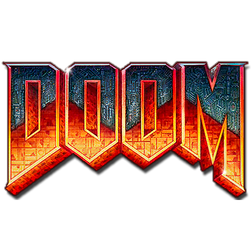

<div align="center">
  
</div>

<div align="center">
  <p>Kill Ops to prove you're a human</p>
  <br />
</div>

> 

<div align="center">
  <p>
    <strong>Doomtcha</strong> is a "CAPTCHA" that requires users to prove they <br/> are human by slaying demons in the classic 1993 game <strong>DOOM</strong>.
  </p>
</div>

---

## Build & Run

### 1. Install Dependencies & Compile

This script installs Emscripten (WASM compiler) and builds the project.

```bash
./installers/install_emscriptem.sh && cd src && make
```

### 2. Run

Serve the `public` directory.

```bash
cd public
python3 -m http.server 8000
```

Visit **[http://localhost:8000](http://localhost:8000)**.

---

## Credits

- **Thomas Van Iseghem**: Creator of [wasmDOOM](https://github.com/VanIseghemThomas/wasmDOOM). His foundational port of Doom to WebAssembly is the core of this project.
- **Alex Oberhofer**: Creator of [sdl2-doom](https://github.com/AlexOberhofer/sdl2-doom).
- **Id Software**: The legends who created DOOM.

**Created by Anant Singhal**

---

## License

GPLv2 (Derived from Doom Source)
