# Doom in WebAssembly: How It Actually Works

This guide explains how the classic 1993 game DOOM runs in your web browser using WebAssembly. Written so you can explain it to anyone.

---

## The Big Picture

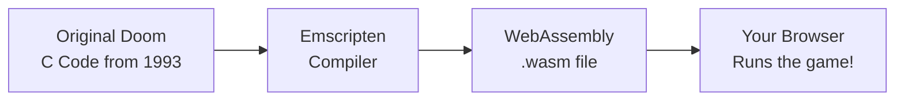

**In plain English:** Someone wrote Doom in the C programming language in 1993. A special tool called Emscripten converts that old C code into WebAssembly - a format that browsers understand. Your browser runs this WebAssembly code, and boom: Doom in your browser.

---

## What is WebAssembly (WASM)?

Think of it like a **translator**.

Your browser speaks "JavaScript". Old video games speak "C/C++". WebAssembly is a **universal language** that both can understand.

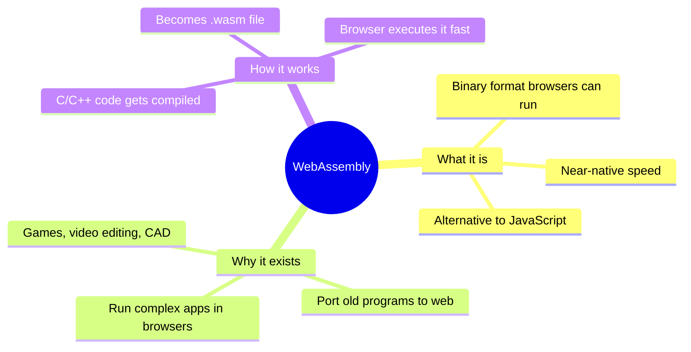

### Real-world analogy

| Scenario   | Real World       | WASM World           |
| ---------- | ---------------- | -------------------- |
| Original   | English book     | C code (doom source) |
| Translator | Google Translate | Emscripten compiler  |
| Target     | Spanish book     | wasm-doom.wasm       |
| Reader     | Spanish speaker  | Your web browser     |

---

## What is a "Doom Port"?

The word "port" means **adapting something to work somewhere new**.

The original Doom was made for MS-DOS computers in 1993. A "Doom port" takes that original code and makes it work on something else - like Windows, Linux, Mac, or in our case: **web browsers**.

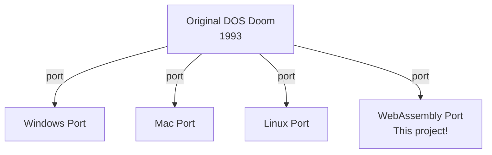

This project is a port that uses:

- **SDL2** - A library that handles graphics, sound, and input
- **Emscripten** - The C-to-WebAssembly compiler

---

## The Key Files Explained

### Project Structure Mind Map

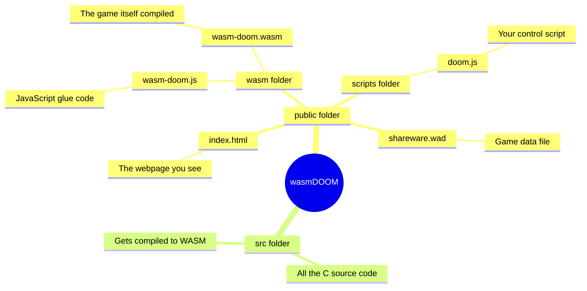

---

### How Files Connect

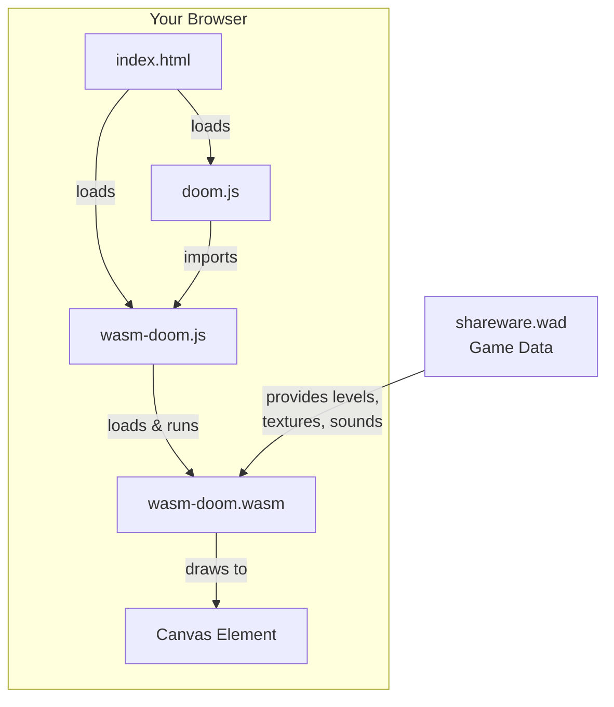

---

## The .WAD File: Where All The Game Data Lives

WAD stands for "**W**here's **A**ll the **D**ata" (yes, really).

It contains:

- All the levels (maps)
- Enemy sprites (images)
- Textures for walls
- Sound effects
- Music

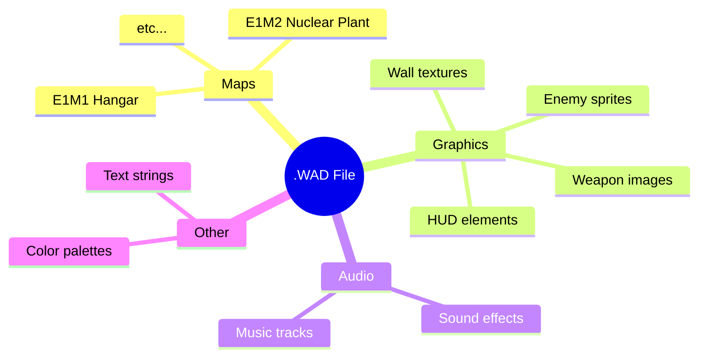

**The game code** (wasm-doom.wasm) is **separate** from the **game content** (.wad file). This is why you can run different WAD files (like custom levels) with the same engine.

---

## How The Game Starts: Step by Step

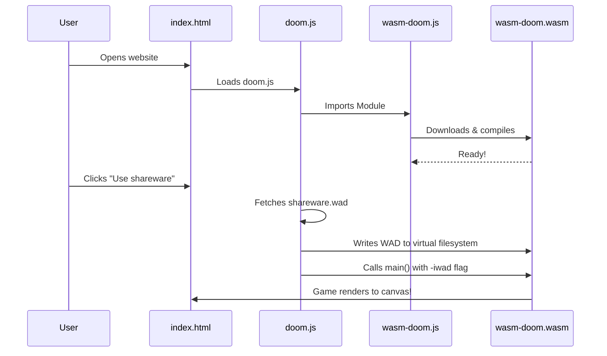

Here's the actual code that does this:

```javascript
// doom.js - Line 44
const doom = await Module(module_args);
// ↑ This loads the compiled Doom engine and waits until it's ready
```

```javascript
// doom.js - Lines 49-59
function LoadDoom(buffer) {
  let errorLabel = document.querySelector(".error-label");
  if (!validateWadFile(buffer)) {
    errorLabel.style.display = "block";
    return;
  }
  errorLabel.style.display = "none";
  canvas.style.display = "block";

  doom.FS.writeFile("/doom-data.wad", buffer);
  // ↑ Writes the WAD file to a virtual filesystem that WASM can access

  doom.callMain(["-iwad", "doom-data.wad"]);
  // ↑ Calls the C "main()" function with arguments, just like running Doom from command line
}
```

---

## The Source Code: How Doom Actually Works

The `src/` folder contains the original Doom source code, modified to work with SDL2 and WASM.

### Code Organization

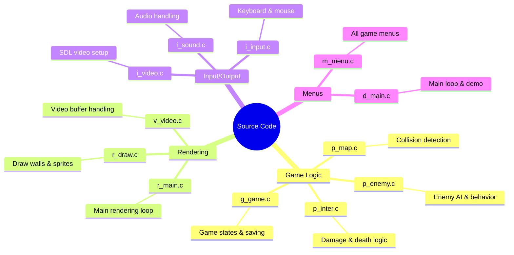

### The Game Loop

Every game has a loop that runs many times per second. Doom's loop:

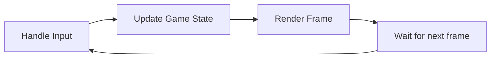

```c
// d_main.c - The handle_loop function (Lines 456-469)
void handle_loop()
{
    D_ProcessEvents();    // Step 1: Read keyboard/mouse input
    // ↑ Check what keys you pressed

    G_BuildTiccmd(&cmd);  // Build commands from input
    // ↑ Turn your key presses into game commands

    TryRunTics();         // Step 2: Update game state
    // ↑ Move enemies, bullets, player - everything

    D_Display();          // Step 3: Draw the frame
    // ↑ Render what you see on screen
}
```

---

## How Enemy Death Works (Key for Doomtcha!)

When you kill an enemy, this function runs:

```c
// p_inter.c - Lines 662-762
void P_KillMobj(mobj_t* source, mobj_t* target)
{
    // Remove the "can be shot" flag
    target->flags &= ~(MF_SHOOTABLE|MF_FLOAT|MF_SKULLFLY);
    // ↑ Enemy can no longer be shot (it's dead)

    // Make it fall to the ground
    if (target->type != MT_SKULL)
        target->flags &= ~MF_NOGRAVITY;
    // ↑ Lost souls don't fall, other enemies do

    // Mark as corpse
    target->flags |= MF_CORPSE|MF_DROPOFF;
    // ↑ Now it's just a body

    // Count the kill!
    if (source && source->player)
    {
        if (target->flags & MF_COUNTKILL)
            source->player->killcount++;
        // ↑ THIS IS WHERE KILLS ARE COUNTED!
    }

    // ... rest handles death animation and item drops
}
```

---

## Compilation: From C to WASM

The Makefile shows how the code is compiled:

```makefile
# src/Makefile - Key lines
CC=emcc
# ↑ Use Emscripten compiler instead of regular gcc

CFLAGS+=-sEXPORTED_RUNTIME_METHODS=FS,callMain
# ↑ Export FS (filesystem) and callMain so JavaScript can use them

CFLAGS+=-sMODULARIZE=1 -sEXPORT_ES6
# ↑ Make it a JavaScript module we can import

CFLAGS+=-sINVOKE_RUN=0
# ↑ Don't start the game automatically - we'll call main() ourselves
```

**Build command:**

```bash
cd src && make
# This compiles all .c files into wasm-doom.wasm
```

---

# Customization Guide

## Skip the Episode/Level Selector

The episode menu is defined in `m_menu.c`:

```c
// m_menu.c - Lines 266-284
enum
{
    ep1,    // Episode 1: Knee Deep in the Dead
    ep2,    // Episode 2: The Shores of Hell
    ep3,    // Episode 3: Inferno
    ep4,    // Episode 4: Thy Flesh Consumed
    ep_end
} episodes_e;

menuitem_t EpisodeMenu[]=
{
    {1,"M_EPI1", M_Episode,'k'},
    {1,"M_EPI2", M_Episode,'t'},
    {1,"M_EPI3", M_Episode,'i'},
    {1,"M_EPI4", M_Episode,'t'}
};
```

### To auto-start the game:

Modify `d_main.c` to skip menus and start directly:

```c
// In D_DoomMain() function, add:
G_DeferedInitNew(sk_medium, 1, 1);  // Start Episode 1, Map 1, Medium difficulty
gameaction = ga_newgame;
// Skip calling D_StartTitle()
```

Or use command-line arguments in JavaScript:

```javascript
// Instead of:
doom.callMain(["-iwad", "doom-data.wad"]);

// Use:
doom.callMain(["-iwad", "doom-data.wad", "-skill", "2", "-warp", "1", "1"]);
// ↑ -skill 2 = medium, -warp 1 1 = Episode 1, Map 1
```

---

## Track Enemy Kills from JavaScript

This is the key part for making Doomtcha!

### Option 1: Modify the C code (requires rebuild)

Add to `p_inter.c` in the `P_KillMobj` function:

```c
// At the top of p_inter.c, add:
#ifdef __EMSCRIPTEN__
#include <emscripten.h>
#endif

// Inside P_KillMobj, after the kill is counted:
if (source && source->player && (target->flags & MF_COUNTKILL))
{
    source->player->killcount++;

    // NEW: Notify JavaScript of the kill!
    #ifdef __EMSCRIPTEN__
    EM_ASM({
        if (window.onDoomKill) {
            window.onDoomKill();
        }
    });
    #endif
}
```

Then in your JavaScript:

```javascript
// Set up the kill listener BEFORE starting the game
window.onDoomKill = function () {
  console.log("Enemy killed!");
  // Do anything you want here!
};
```

### Option 2: Poll the kill count (no rebuild needed)

Export the player's killcount and check it periodically:

```javascript
// This would require exporting the players array from WASM
// Less elegant but doesn't require recompiling
```

---

# Doomtcha Implementation Guide

Here's how to build a Doom CAPTCHA:

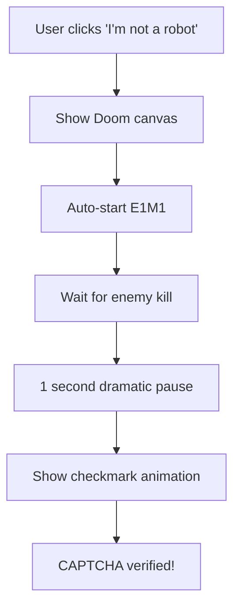

### Files to Create/Modify

| File         | What to do                            |
| ------------ | ------------------------------------- |
| `p_inter.c`  | Add `EM_ASM` callback in `P_KillMobj` |
| `Makefile`   | Rebuild WASM after changes            |
| `doom.js`    | Add `window.onDoomKill` handler       |
| `index.html` | Add CAPTCHA UI elements               |
| `styles.css` | Style the CAPTCHA box                 |

### Complete Implementation

#### 1. Modify `p_inter.c`

```c
// Find the P_KillMobj function and add after killcount++:

#ifdef __EMSCRIPTEN__
#include <emscripten.h>
#endif

// In P_KillMobj function:
if (source && source->player)
{
    if (target->flags & MF_COUNTKILL)
    {
        source->player->killcount++;

        // Notify JavaScript
        #ifdef __EMSCRIPTEN__
        EM_ASM({
            if (window.onDoomKill) window.onDoomKill();
        });
        #endif
    }
}
```

#### 2. Rebuild the WASM

```bash
cd src
make clean
make
```

#### 3. Create the Doomtcha JavaScript

```javascript
// doomtcha.js
let captchaVerified = false;
let killDetected = false;

// Called when enemy dies in Doom
window.onDoomKill = function () {
  if (!captchaVerified && !killDetected) {
    killDetected = true;
    console.log("Kill detected! Verifying in 1 second...");

    // Dramatic pause
    setTimeout(() => {
      captchaVerified = true;
      showSuccessAnimation();
    }, 1000);
  }
};

function showSuccessAnimation() {
  const canvas = document.getElementById("canvas");
  const checkmark = document.getElementById("captcha-checkmark");

  // Hide doom, show checkmark
  canvas.style.display = "none";
  checkmark.style.display = "block";
  checkmark.classList.add("verified");

  // Enable form submission or whatever comes next
  document.getElementById("submit-btn").disabled = false;
}

function startDoomtcha() {
  // Hide the "I'm not a robot" button
  document.getElementById("captcha-button").style.display = "none";

  // Show the canvas
  const canvas = document.getElementById("canvas");
  canvas.style.display = "block";

  // Load and start Doom automatically
  fetch("/shareware.wad")
    .then((response) => response.arrayBuffer())
    .then((buffer) => {
      const data = new Uint8Array(buffer);
      doom.FS.writeFile("/doom-data.wad", data);
      // Start Episode 1, Map 1, Skill 2 (medium)
      doom.callMain([
        "-iwad",
        "doom-data.wad",
        "-skill",
        "2",
        "-warp",
        "1",
        "1",
      ]);
    });
}
```

#### 4. HTML Structure

```html
<div class="doomtcha-container">
  <div id="captcha-box">
    <button id="captcha-button" onclick="startDoomtcha()">
      <span class="checkbox"></span>
      I'm not a robot
    </button>

    <canvas id="canvas"></canvas>

    <div id="captcha-checkmark" style="display: none;">✓ Verified</div>
  </div>

  <button id="submit-btn" disabled>Continue</button>
</div>
```

### Flags Reference

| Flag          | Effect                                |
| ------------- | ------------------------------------- |
| `-skill N`    | 1=Easy, 2=Medium, 3=Hard, 4=Nightmare |
| `-warp E M`   | Start at Episode E, Map M             |
| `-fast`       | Fast monsters                         |
| `-nomonsters` | No enemies (don't use for captcha!)   |
| `-turbo N`    | Player speed multiplier               |

---

## Summary

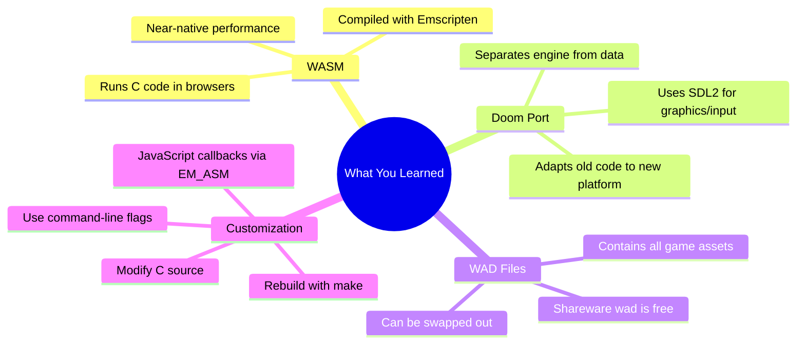

---

## Quick Reference

| What              | Where                            |
| ----------------- | -------------------------------- |
| Enemy kill logic  | `src/p_inter.c` → `P_KillMobj()` |
| Enemy AI          | `src/p_enemy.c`                  |
| Menu system       | `src/m_menu.c`                   |
| Main game loop    | `src/d_main.c` → `handle_loop()` |
| JavaScript glue   | `public/wasm/wasm-doom.js`       |
| Your control code | `public/scripts/doom.js`         |
| Build config      | `src/Makefile`                   |
